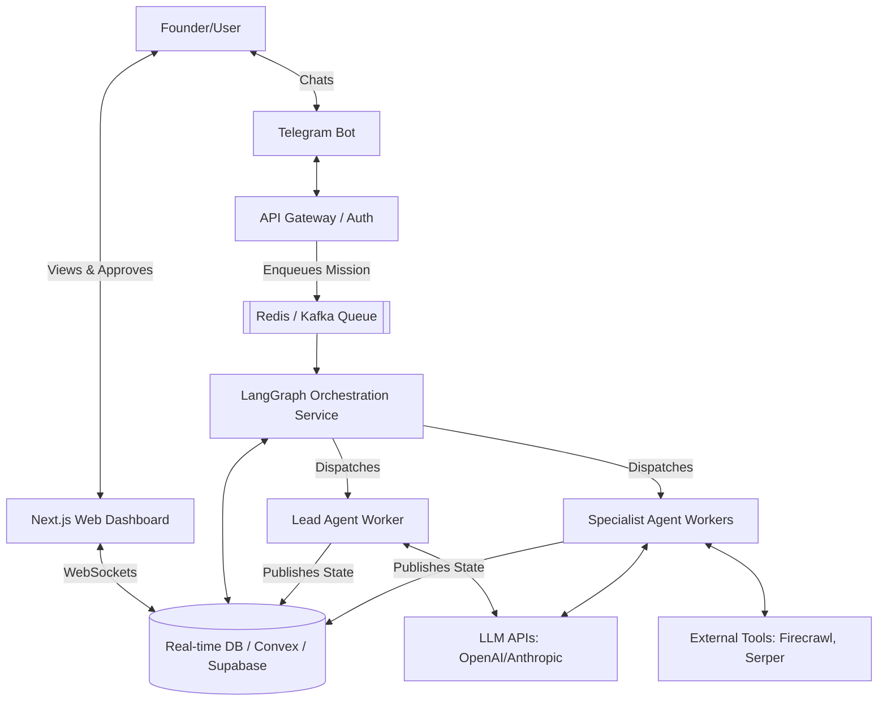

# Solution Architecture & Infrastructure: Mission Control Clone

**Date:** June 10, 2026
**Subject:** High-Level Design (HLD) and Infrastructure Strategy for Multi-Agent Command Center

---

## 1. System Architecture Overview

The platform must support asynchronous, long-running agent workflows with real-time observability. A standard request-response HTTP cycle is insufficient. We require an event-driven architecture with real-time state synchronization.

### High-Level Components
1.  **Client Interfaces (Frontend & Ingress):**
    *   **Telegram Bot / Slack App:** The primary conversational ingress for the user to chat with the "Lead Agent".
    *   **Web Dashboard (Control Plane):** A Next.js application for real-time monitoring of the squad, viewing assets, and injecting human feedback.
2.  **API Gateway & Auth:** Routes incoming webhooks (Telegram) and web traffic. Handles user authentication and BYOK (Bring Your Own Key) credential decryption.
3.  **Real-Time State Layer:** The single source of truth that synchronizes the backend agent states with the frontend dashboard in <100ms.
4.  **Orchestration Engine (The Brain):** Manages the lifecycle of multi-agent state machines (graphs), pauses for human input, and handles retries.
5.  **Agent Runtimes (Workers):** Isolated execution environments where the actual LLM calls and tool usage (e.g., Python execution, web browsing) happen.

---

## 2. Component Diagram (Mermaid)

---

## 3. Technology Stack Selection

| Component | Recommended Technology | Justification |
| :--- | :--- | :--- |
| **Frontend Dashboard** | **Next.js (React) + TailwindCSS** | Industry standard, rich ecosystem for building complex dashboards (e.g., React Flow for agent graphs). |
| **Real-time DB** | **Convex** (or **Supabase**) | Convex provides built-in reactivity. If a Python backend updates the DB, the React UI updates instantly via WebSockets without extra wiring. |
| **Agent Orchestration**| **LangGraph (Python)** | Best-in-class for cyclic, stateful multi-agent workflows. Natively supports "Human-in-the-loop" pauses and state persistence. |
| **Async Queues** | **Temporal.io** or **Celery + Redis** | Temporal is preferred for long-running workflows (agents running for 24+ hours) due to its fault tolerance and state recovery. |
| **Vector Storage** | **pgvector (via Supabase)** | Unified storage for relational data (users, missions) and long-term memory (agent RAG context). |

---

## 4. Infrastructure & Deployment Strategy

To ensure security, scalability, and "Isolated Runtimes" for enterprise/agency clients, the infrastructure should be tiered:

### Option A: The Agile Startup Stack (Fastest TTM)
*   **Frontend:** Vercel (Next.js)
*   **Database & Real-time:** Convex (Managed)
*   **Orchestration/Workers:** Render or Railway (Background Python Workers)
*   *Pros:* Minimal DevOps overhead.
*   *Cons:* Less control over agent isolation.

### Option B: The Enterprise / "Mission Control" Stack (High Security)
*   **Cloud Provider:** AWS
*   **Frontend:** AWS Amplify or Vercel
*   **Database:** Amazon Aurora PostgreSQL (with pgvector) + Redis ElasticCache
*   **Orchestration:** EKS (Elastic Kubernetes Service)
*   **Isolated Runtimes:** **AWS Firecracker microVMs** or strictly sandboxed Docker containers. When a squad is launched, they get an ephemeral namespace. This prevents "Agent A" from accidentally accessing data from "Agent B's" client.

---

## 5. Critical Data Flows

### A. The "Squad Setup" Flow
1. User sends voice note/text to Telegram: *"I need to launch a new SaaS for dentists."*
2. **Lead Agent** wakes up, queries the user's BYOK keys, and starts a conversational loop.
3. Lead Agent publishes a proposed "Squad Roster" to the **RealtimeDB**.
4. User sees the proposed squad on the Dashboard and clicks "Approve."

### B. The "Autonomous Work" Flow
1. Orchestrator triggers the **LangGraph State Machine**.
2. **Research Agent** is activated, calls Serper.dev API, and summarizes dentist software.
3. Research Agent writes its findings to the graph state.
4. **RealtimeDB** detects the state change; the Dashboard immediately shows: *"Research Agent: 'Found 3 competitors...' "*
5. **Copywriter Agent** wakes up, reads the research, and generates landing page copy.
6. The state pauses at a "Human Checkpoint". The Dashboard pings the user: *"Copy ready for review."*

---

## 6. Security & Cost Architecture

### BYOK (Bring Your Own Key) Vault
*   **Problem:** Holding user OpenAI keys is a massive liability.
*   **Solution:** Use a service like **Doppler** or **AWS KMS**. Keys are encrypted at rest and only decrypted in-memory inside the isolated worker container during the LLM call.

### Token Cost Tracking
*   Even with BYOK, the platform must track token usage to show the user the ROI.
*   **Architecture:** Implement a token-counting middleware (e.g., Langfuse or Helicone) that intercepts every LLM call made by the workers, tallies the tokens, and updates the `mission_costs` table in the database.
