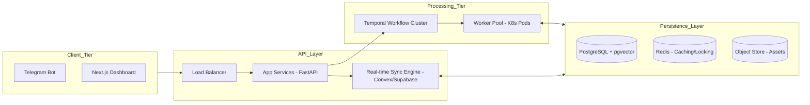
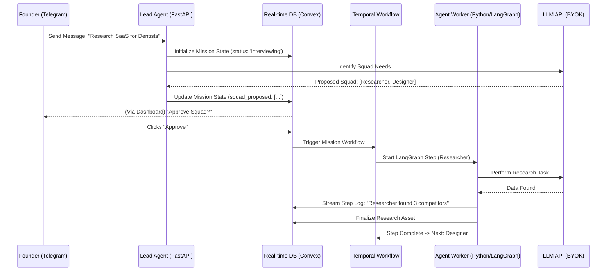

# Detailed Engineering Blueprint: Mission Control Clone

**Version:** 1.0.0  
**Status:** Architecture Design (HLD/LLD)

---

## 1. High-Level Design (HLD): Scalable Infrastructure

To achieve horizontal scalability, the system is decomposed into stateless services and a centralized state store.

### A. Scalability Architecture (The "Macro" View)



#### Key Scalability Patterns:
1.  **Stateless API:** App services can be scaled horizontally behind the Load Balancer.
2.  **Worker Auto-scaling:** The Worker Pool uses K8s HPA (Horizontal Pod Autoscaler) based on the number of active "Missions" in the Temporal queue.
3.  **Database Sharding (Future):** PostgreSQL handles metadata, while the Object Store (S3) handles large agent-generated assets (PDFs, Images, Code).

---

## 2. Low-Level Design (LLD): The Logic Layer

### A. Sequence Diagram: Mission Execution
This diagram shows the exact lifecycle of a "Mission" from Telegram ingress to Dashboard visibility.



### B. Class Design: Agent State Machine (LangGraph)
Each "Mission" is a graph. The LLD for the Graph State is crucial for persistence.

```python
class MissionState(TypedDict):
    # Metadata
    mission_id: str
    founder_id: str
    
    # Context
    input_brief: str
    squad: List[AgentProfile]
    
    # The "Memory"
    shared_context: str  # Accumulates research, drafts, etc.
    messages: List[BaseMessage]  # Full conversation history between agents
    assets: List[AssetRef]
    
    # Flow Control
    current_agent: str
    needs_approval: bool
    status: str # 'active', 'paused', 'shipped'
```

### C. Database Schema (LLD)

#### Table: `missions`
| Column | Type | Description |
| :--- | :--- | :--- |
| `id` | UUID (PK) | Unique Mission ID |
| `org_id` | UUID (FK) | Owner Organization |
| `status` | Enum | [Draft, Active, Paused, Completed, Failed] |
| `context_window`| JSONB | Current cumulative intelligence gathered by the squad |
| `temporal_run_id`| TEXT | Reference to the async workflow |

#### Table: `agent_logs` (The Real-time Feed)
| Column | Type | Description |
| :--- | :--- | :--- |
| `id` | BIGINT | Sequence ID |
| `mission_id` | UUID (FK) | |
| `agent_name` | TEXT | e.g., "Fury", "Loki" |
| `message` | TEXT | The raw output/thought of the agent |
| `type` | TEXT | [thought, action, response, error] |
| `created_at` | TIMESTAMP | |

---

## 3. Worker Isolation Strategy (Scalable Security)

To prevent Agent A from one company interacting with data from Company B, we use **Namespace Isolation**.

1.  **Compute:** Every `Temporal Activity` that executes an LLM call or a Tool runs inside an ephemeral Docker container or a WebAssembly (Wasm) sandbox.
2.  **Network:** Workers have "egress-only" access to LLM APIs and search tools. They cannot communicate with each other except through the **Real-time DB** state changes.
3.  **Storage:** Mount-point isolation. Chunks of RAG data for a specific mission are mounted only during that mission's lifecycle.

---

## 5. Multi-Tenant Tiered Architecture (Pricing Alignment)

To support the pricing tiers ($99 Basic to $499+ Enterprise), the infrastructure must implement **Resource Quotas** and **Priority Scheduling**.

### A. Tier Definitions & Resource Mapping

| Tier | "MissionControl" Sync | Agent Squad Capacity | Infrastructure Profile |
| :--- | :--- | :--- | :--- |
| **Basic ($99)** | Shared Cluster | 1 Active Squad (3 agents) | Shared Kubernetes Namespace, burstable CPU. |
| **Pro ($499)** | Dedicated Namespace | 3 Active Squads (6 agents) | Higher priority in Temporal queue, persistent RAG cache. |
| **Enterprise** | Private Cloud / On-Prem | Unlimited / Custom | **Isolated Firecracker microVMs**, dedicated DB instance, SOC2-compliant logging. |

### B. The "Priority-Aware" Orchestrator

The `Temporal Workflow` and `Worker Pool` must be aware of the `user_tier`.

1.  **Queue Prioritization:** Missions from **Pro/Enterprise** users are routed to a high-priority Temporal task queue to ensure <1s startup time.
2.  **Runtime Isolation (Security vs. Cost):**
    *   **Basic/Pro:** Agents run in shared pods with strong Docker-level isolation.
    *   **Enterprise:** Every mission triggers a dedicated **Firecracker microVM** (similar to AWS Lambda's architecture) to ensure zero cross-talk between tenants.

### C. Tiered Database Schema Updates

#### Table: `organizations` (Updated)
| Column | Type | Description |
| :--- | :--- | :--- |
| `tier` | Enum | [Basic, Pro, Enterprise] |
| `max_agents` | INTEGER | Hard limit on concurrent agents based on tier |
| `storage_quota` | BIGINT | Limit for asset storage (S3) |
| `byok_required` | BOOLEAN | Enterprise may require local vault integration |

---

## 6. MVP Implementation Roadmap

### Milestone 1: The "Hollow" Dashboard (Week 1)
*   Deploy Next.js on Vercel.
*   Setup Convex for real-time tables.
*   Manual DB update triggers UI state change (Verification of Real-time Layer).

### Milestone 2: The Lead Agent & Telegram (Week 2)
*   Deploy FastAPI gateway.
*   Connect Telegram Webhook.
*   Lead Agent uses a basic system prompt to generate a JSON "Squad Proposal" in Convex.

### Milestone 3: The LangGraph Worker (Week 3)
*   Deploy a single Python worker running LangGraph.
*   Implement the "Researcher" agent.
*   Connect the worker to Convex to push logs as it "thinks."

### Milestone 4: BYOK & Human-in-the-loop (Week 4)
*   Implement encryption vault for user API keys.
*   Add the `Interrupt` logic in LangGraph to pause for dashboard approval.
